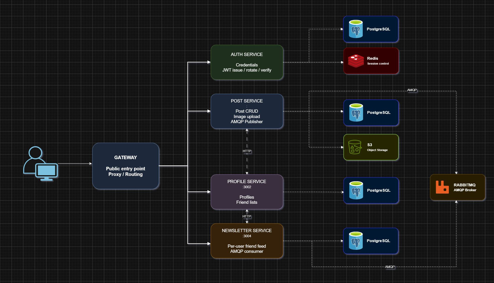
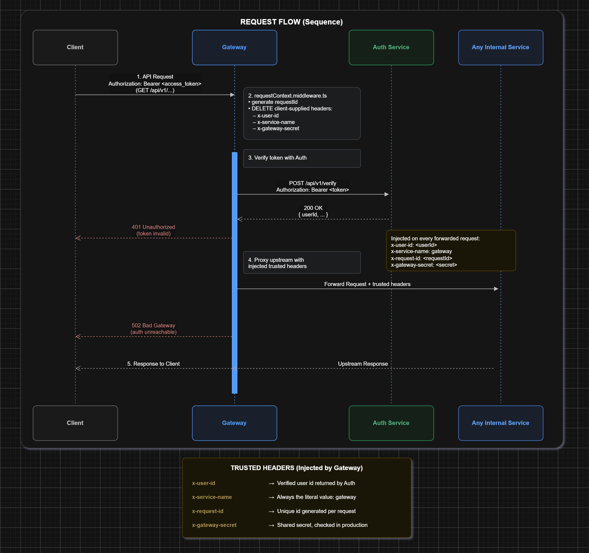

# Pavilion — Backend

A social network backend built on a microservice architecture.

Node 24 · TypeScript (strict) · Express 4 · Prisma 6 / PostgreSQL 16 · Redis · RabbitMQ · MinIO · Docker Compose · pnpm 10.13.1

---

## Architecture



| Service      | Port | Responsibility                                 | Backing stores     |
| ------------ | ---- | -----------------------------------------------| -------------------|
| `gateway`    | 8080 | Public entry point: token termination + proxy  | N/A                |
| `auth`       | 3000 | Credentials, JWT issue / rotate / verify       | Postgres, Redis    |
| `post`       | 3001 | Post CRUD, image upload                        | Postgres, S3/MinIO |
| `profile`    | 3002 | Profiles, friend lists                         | Postgres           |
| `newsletter` | 3004 | Per-user friend feed (AMQP consumer)           | Postgres, RabbitMQ |

`gateway` is the only service a client talks to; the other four are internal. Each service owns
its own database — no cross-service DB access, no shared code module. Types and utilities that two
services need are duplicated, deliberately.

---

## Quick start

```bash
cp .env.example .env
docker compose up
```

That is the whole setup. There are no host prerequisites beyond Docker.

- `docker-compose.override.yml` applies automatically and selects each image's `dev` target —
  nodemon over `ts-node`, with `services/<svc>/src` bind-mounted. Editing a file on the host
  restarts the process in the container.
- Production shape (compiled `dist/`, prod deps only, port 8080 the only one published):
  `docker compose -f docker-compose.yml up --build`.
- **Postgres is published on host port 5433**, not 5432 — a native install commonly holds 5432.
  Inside the compose network services still connect to `postgres:5432`.
- One Postgres container holds four databases, each with its own non-superuser role, created by
  `docker/postgres/init-databases.sh`. That script runs **only** on first creation of the volume;
  `docker compose down -v` wipes the volumes and forces a re-run.
- Each service's entrypoint runs `prisma migrate deploy` before starting, so a cold
  `docker compose up` yields a fully migrated system.

| Interface        | URL                      |
| ---------------- | ------------------------ |
| API (gateway)    | `http://localhost:8080`  |
| RabbitMQ console | `http://localhost:15672` |
| MinIO console    | `http://localhost:9001`  |
| MinIO S3 API     | `http://localhost:9000`  |
| Postgres         | `localhost:5433`         |

In dev the four service ports (3000 / 3001 / 3002 / 3004) are republished and directly callable.
In the production target they are not.

---

## Request flow



1. The client sends `Authorization: Bearer <access token>` to the gateway. Nothing else is public.
2. `requestContext.middleware.ts` assigns a `requestId` and **deletes any client-supplied
   `x-user-id`, `x-service-name` and `x-gateway-secret`**. This is why the gateway exists —
   downstream services trust `x-user-id` unconditionally, so a smuggled one would be full
   impersonation.
3. `requireAuth` resolves the token through `auth POST /api/v1/verify`. A 401 from auth becomes a
   401 to the client; an unreachable auth service becomes a 502, not a bad token.
4. The proxy streams the request upstream with `x-user-id`, `x-service-name: gateway`,
   `x-request-id` and `x-gateway-secret` set by the gateway itself.
5. `post`, `profile` and `newsletter` map those headers onto `req.userId`, `req.serviceName` and
   `req.requestId` via `requestHeaderHandler`. They never parse a JWT — JWT verification lives
   only in `auth`, and the gateway holds no token secret.

`/api/v1/auth/*` is the only public upstream (logging in cannot require being logged in) and the
only path rewritten: `^/api/v1/auth` → `/api/v1`, because auth mounts its routes flat.
`/api/v1/auth/verify` is hard-blocked with a 404 — token introspection is the gateway's own tool.

Verification is **not cached**: every protected request costs one call to `auth`.

When `NODE_ENV=production`, the four services reject any request whose `x-gateway-secret` does not
match (`gatewayOnly.middleware.ts`). `/api/v1/health` is always exempt so healthchecks keep working.

---

## API

All paths are as exposed by the gateway.

| Method   | Path                                             | Purpose                            | Auth   |
| -------- | ------------------------------------------------ | ---------------------------------- | ------ |
| `GET`    | `/api/v1/health`                                 | Liveness                           | public |
| `POST`   | `/api/v1/auth/register`                          | Create account → token pair        | public |
| `POST`   | `/api/v1/auth/login`                             | Verify credentials → token pair    | public |
| `POST`   | `/api/v1/auth/refresh`                           | Rotate the token pair              | public |
| `POST`   | `/api/v1/auth/logout`                            | Revoke the stored refresh token    | public |
| `POST`   | `/api/v1/post`                                   | Create post (`multipart/form-data`) | bearer |
| `GET`    | `/api/v1/post/:postId`                           | Fetch one post                     | bearer |
| `GET`    | `/api/v1/post/user/:userId`                      | Author's posts, cursor-paginated   | bearer |
| `PUT`    | `/api/v1/post/:postId`                           | Update content (owner only)        | bearer |
| `DELETE` | `/api/v1/post/:postId`                           | Delete post (owner only)           | bearer |
| `POST`   | `/api/v1/profile`                                | Create profile                     | bearer |
| `GET`    | `/api/v1/profile/:userId`                        | Fetch profile                      | bearer |
| `PUT`    | `/api/v1/profile/:userId`                        | Update name and avatar             | bearer |
| `POST`   | `/api/v1/profile/:userId/friends`                | Add a friend                       | bearer |
| `DELETE` | `/api/v1/profile/:userId/friends/:friendId`      | Remove a friend                    | bearer |
| `GET`    | `/api/v1/newsletter`                             | Own feed, cursor-paginated         | bearer |

Request and response shapes per endpoint are documented in each `services/<service>/CLAUDE.md`.

### Response envelope

Every response from every service uses one envelope. The error message lives in `data`, not in a
separate key.

```jsonc
{ "success": true,  "data": { } }        // success
{ "success": false, "data": "message" }  // error
```

Handlers never build this by hand — `responseHandler` middleware supplies `res.success(data)` and
`res.error(message, statusCode)`.

### Smoke test

```bash
# 1. Register and capture the access token
TOKEN=$(curl -s -X POST http://localhost:8080/api/v1/auth/register \
  -H 'Content-Type: application/json' \
  -d '{"email":"dev@pavilion.local","password":"secret123"}' | jq -r .data.accessToken)

# 2. Create a post as that user
curl -s -X POST http://localhost:8080/api/v1/post \
  -H "Authorization: Bearer $TOKEN" \
  -F 'content=hello pavilion' \
  -F 'image=@./photo.jpg'
```

Tokens: access 15 minutes, refresh 7 days. The refresh token is stored in Redis keyed by user id,
so only one is active at a time — every refresh rotates it and invalidates the previous one.

---

## Configuration

`.env` at the repo root configures the whole stack; compose injects these into the containers. The
per-service `services/*/.env` files are excluded from the images and apply only when running a
service directly on the host.

| Variable | Purpose |
| --- | --- |
| `POSTGRES_USER`, `POSTGRES_PASSWORD` | Superuser for the Postgres container itself |
| `SERVICE_DB_PASSWORD` | Shared password for the four per-service database roles |
| `POSTGRES_HOST_PORT` | Host port for Postgres (default `5433`) |
| `REDIS_PASSWORD` | Redis auth for `auth`. Must be non-empty — the dev default does not apply in production |
| `ACCESS_TOKEN_SECRET`, `REFRESH_TOKEN_SECRET` | JWT signing secrets; separate by design |
| `MINIO_ROOT_USER`, `MINIO_ROOT_PASSWORD` | MinIO admin credentials |
| `S3_BUCKET_NAME` | Bucket created on boot by the `minio-init` one-shot container |
| `S3_ACCESS_KEY_ID`, `S3_SECRET_ACCESS` | Credentials `post` uses against the bucket |
| `RABBITMQ_USER`, `RABBITMQ_PASSWORD` | Broker credentials |
| `GATEWAY_SECRET` | Proves a request came through the gateway. Enforced only when `NODE_ENV=production` |

Every service validates its own environment with envalid in `src/config.ts`; a missing or
malformed variable fails at boot rather than at first use.

---

## Development

Run from `services/<service>/`:

```bash
pnpm dev          # nodemon + ts-node
pnpm build        # tsc && tsc-alias
pnpm start        # node dist/main.js
pnpm biome check  # lint + format
```

`pnpm build` **must** stay `tsc && tsc-alias` in every service — `tsc` alone leaves `@utils/...`
requires in `dist/`, which crashes at runtime.

### Conventions

- Routes live under `/api/v1`; every service exposes `GET /api/v1/health`.
- One Prisma model per service in `prisma/schema.prisma`; migrations are committed.
- Path aliases (`@/`, `@utils/`, `@middlewares/`, …) are defined per service in `tsconfig.json`.
- Biome is the linter and formatter: tabs, 120 columns, single quotes.
- Commits are tagged with the service: `[POST] fix: ownership check on delete`.

### Boundaries

- A service queries only its own database, and never imports code from another service's directory.
- JWT validation exists only in `auth`. Never add it to `post`, `profile`, `newsletter` or `gateway`.
- In downstream services read `req.userId`, never the raw `x-user-id` header.
- Never add a body parser to `gateway` — a consumed request body cannot be streamed upstream, which
  breaks `post`'s multipart upload.
- Only `gateway` is exposed externally.
- There is no shared module. If two services need the same type or util, duplicate it.

Adding a service is scripted in `services/agent_docs/new-service-creation.md`. A new downstream
route is not publicly reachable until `services/gateway/src/proxy/routes.ts` proxies it.

---

## Status & known gaps

The stack runs end to end, but the following are real and unfinished:

- **Feeds are always empty.** `post` does not yet publish `post.published`. The broker, the
  `post.events` exchange and the `newsletter` consumer are all in place and waiting, so
  `GET /api/v1/newsletter` returns `{ posts: [], cursor: null }` until the publisher is built.
- **`newsletter` → `profile` calls omit `x-gateway-secret`**, so they would be rejected with a 403
  under `NODE_ENV=production`. Currently masked because the fan-out path never runs.
- **`profile` has no ownership checks.** Its write endpoints take `userId` from the body or path
  and never compare it to `req.userId`, so any authenticated user can act on another's profile.
- **`PUT /api/v1/profile/:userId` is a full replace, not a patch.** Omitting `name` resets it to
  `Anonymous`.
- **Deleting a post orphans its S3 object** — the row is hard-deleted, the upload is not.
- **No test suite and no CI.**
- The `readme.md` files under `services/auth`, `services/post` and `services/profile` are stale
  stubs. Treat each service's `CLAUDE.md` as authoritative.

---

## Repository layout

```
.
├── docker/postgres/init-databases.sh   # creates the four per-service DBs and roles
├── docker-compose.yml                  # production shape
├── docker-compose.override.yml         # dev target: nodemon + bind-mounted src/
├── .env.example
└── services/
    ├── gateway/      # public entry point (8080)
    ├── auth/         # tokens (3000)
    ├── post/         # posts + uploads (3001)
    ├── profile/      # profiles + friends (3002)
    ├── newsletter/   # feed consumer (3004)
    └── agent_docs/   # service scaffolding + gateway specs
```

Each service follows the same internal shape:

```
src/
├── config.ts        # envalid-validated environment
├── main.ts          # middleware chain, startup gates, listen
├── controllers/
├── middlewares/
├── routes/v1/
├── schemas/         # Zod, where validation is needed
└── utils/           # prisma, logger, asyncHandler
```
